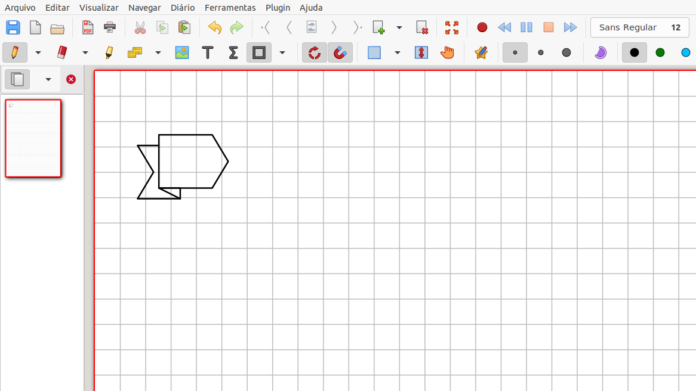

# Xournal Plugin BulletJournalGraphs

## Introduction
`Xournalpp` plugin to made bullet journal graphics.

  * **BulletJournalGraphs** The directory of plugin.
  * **makedeb** This directory contain the script to generate `xournalpp-plugin-bulletjournalgraphs.deb` binary file.
  * **extras** This directory has some data and theory to develop the plugin (this directory is only relevant to the developer).

## Install

To install the plugin follow any of these methods:

  * Copy the directory `BulletJournalGraphs` inside the path `/usr/share/xournalpp/plugins/`, or
  * Create the install `xournalpp-plugin-bulletjournalgraphs.deb` binary file executing the script in `makedeb` directory, following this commands:

        cd makedeb
        ./makedeb.sh

## Using

### Arrow bullet `<Ctrl><Alt>a` (by default)

## Optional
If you wish, you can :

  * Modify the text in the menu item.
  * Modify the accelerator key.

This can be made creating the `.BulletJournalGraphs.json` file in the `home` path. In Gnu-Linux operating system, the full path will be in: `/home/username/.BulletJournalGraphs.json`
The next code is an example of `/home/username/.BulletJournalGraphs.json` file.

    {
        "ArrowBullet":
        {
            "accelerator":"<Control><Alt>a",
            "menu":"Add arrow bullet"
        },
        "TitleRound":
        {
            "accelerator":"<Control><Alt>r",
            "menu":"Add round box title"
        }
    }
